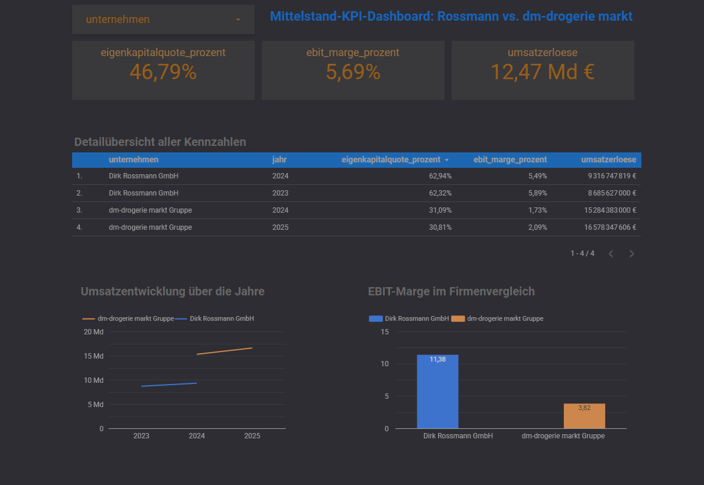

# 📊 Financial Performance Benchmarking – Rossmann vs. dm

> **End-to-End Data Analytics & Business Intelligence Portfolio Project**

## Executive Summary

This project benchmarks the financial performance of **Dirk Rossmann GmbH** and **dm-drogerie markt Gruppe** using Google BigQuery and SQL.

The analysis combines four management perspectives:

- **Business scale** → Revenue
- **Operating profitability** → EBIT Margin
- **Financial resilience** → Equity Ratio
- **Development over time** → Revenue Growth

### Key findings

| Dimension | Rossmann | dm | Interpretation |
|---|---:|---:|---|
| Revenue scale | Lower | Higher | dm operates at a larger revenue scale |
| EBIT Margin | **5.49–5.89%** | **1.73–2.09%** | Rossmann shows stronger operating profitability |
| Equity Ratio | **62.32–62.94%** | **30.81–31.09%** | Rossmann shows stronger equity capitalization |
| Revenue trend | Growing | Growing | Both grow in the available observations |

> **Management takeaway:** dm demonstrates greater scale, while Rossmann demonstrates stronger profitability and a stronger equity position in the available observations.

## 🎯 Business Problem

Revenue alone does not provide a complete picture of company performance.

The project answers:

1. How does revenue develop over time?
2. Which company has the stronger EBIT margin?
3. Which company has the stronger equity ratio?
4. How large are the KPI differences?
5. What conclusions can management draw?

## 📈 Dashboard


**Overview → Comparison → Detail → Business Interpretation**

---

## 1. Project Overview

This project analyzes and compares selected financial KPIs of two major German drugstore retailers:

- **Dirk Rossmann GmbH**
- **dm-drogerie markt Gruppe**

The goal is to transform company-level financial data into a compact management dashboard that answers practical business questions around **growth, profitability and financial stability**.

The project demonstrates an end-to-end BI workflow:

**Raw financial data → BigQuery → SQL transformation → KPI model → dashboard → management insights**

---

## 2. Business Questions

The dashboard is designed to answer five core questions:

1. **How did revenue develop over time?**
2. **Which company has the stronger EBIT margin?**
3. **How does financial stability differ based on the equity ratio?**
4. **How do the companies compare across the available reporting years?**
5. **What management-level conclusions can be derived from the KPI differences?**

---

## 3. KPI Framework

| KPI | Definition | Business relevance |
|---|---|---|
| Revenue | `Umsatzerlöse` | Measures company scale and top-line development |
| EBIT | `EBIT` | Operating profit before interest and taxes |
| EBIT Margin | `EBIT / Revenue × 100` | Measures operating profitability |
| Equity Ratio | `Equity / Balance Sheet Total × 100` | Indicates financial stability and capital structure |
| Revenue Growth | Year-over-year change in revenue | Measures business expansion |

### Current calculated comparison

Based on the available project data:

- Rossmann shows a substantially higher **EBIT margin** than dm in the available years.
- dm has the higher **absolute revenue** in the displayed periods.
- Rossmann has the higher **equity ratio** in the displayed data.
- Both companies show revenue growth between the available reporting years.

> **Important:** The figures are portfolio-project calculations and should not be interpreted as a complete valuation or investment recommendation.

---

## 4. Dashboard

### Management Overview


The dashboard combines:

- Company selector
- KPI cards
- Detailed KPI table
- Revenue development
- EBIT margin comparison

The design intentionally focuses on a small number of management-relevant KPIs instead of displaying every available financial metric.

---

## 5. Data Architecture

The current BigQuery dataset is organized around two primary financial tables:

```text
mittelstand_kpi
│
├── guv
│   ├── Unternehmen
│   ├── Branche
│   ├── Jahr
│   ├── Umsatzerlöse
│   ├── Materialaufwand
│   ├── Personalaufwand
│   ├── Abschreibungen
│   ├── Sonstige betriebliche Aufwendungen
│   ├── EBIT
│   ├── Finanzergebnis
│   ├── Steuern
│   └── Jahresüberschuss
│
└── bilanz
    ├── Unternehmen
    ├── Jahr
    ├── Eigenkapital
    └── Bilanzsumme
```

The KPI layer combines the income statement (`guv`) with balance-sheet data (`bilanz`) using:

```text
Unternehmen + Jahr
```

---

## 6. BigQuery Transformation

The core analytical query calculates the two main derived KPIs:

```sql
ROUND(g.ebit / g.umsatzerloese * 100, 2) AS ebit_marge_prozent,
ROUND(b.eigenkapital / b.bilanzsumme * 100, 2) AS eigenkapitalquote_prozent
```

Full query:

```sql
SELECT
  g.unternehmen,
  g.jahr,
  g.umsatzerloese,
  g.ebit,
  ROUND(g.ebit / g.umsatzerloese * 100, 2) AS ebit_marge_prozent,
  ROUND(b.eigenkapital / b.bilanzsumme * 100, 2) AS eigenkapitalquote_prozent
FROM `mittelstand-kpi.mittelstand_kpi.guv` g
JOIN `mittelstand-kpi.mittelstand_kpi.bilanz` b
  ON g.unternehmen = b.unternehmen
  AND g.jahr = b.jahr
ORDER BY g.unternehmen, g.jahr;
```

The production version is stored in:

`sql/01_kpi_combined.sql`

---

## 7. Example Result

| Unternehmen | Jahr | Umsatz | EBIT | EBIT-Marge | Eigenkapitalquote |
|---|---:|---:|---:|---:|---:|
| Dirk Rossmann GmbH | 2023 | €8.69 Bn | €511.37 M | 5.89% | 62.32% |
| Dirk Rossmann GmbH | 2024 | €9.32 Bn | €511.53 M | 5.49% | 62.94% |
| dm-drogerie markt Gruppe | 2024 | €15.28 Bn | €263.99 M | 1.73% | 31.09% |
| dm-drogerie markt Gruppe | 2025 | €16.58 Bn | €346.51 M | 2.09% | 30.81% |

### Interpretation

**Revenue:** dm operates at a larger revenue scale in the available observations.

**Profitability:** Rossmann generates the stronger operating margin in the displayed years.

**Financial stability:** Rossmann's equity ratio is materially higher in the available data.

**Trend:** dm's EBIT margin improves from 1.73% to 2.09%, while Rossmann's margin changes only slightly between 2023 and 2024.

---

## 8. Repository Structure

```text
mittelstand-kpi-dashboard/
│
├── README.md
├── .gitignore
├── LICENSE
│
├── sql/
│   ├── 01_kpi_combined.sql
│   └── 02_management_analysis.sql
│
├── data/
│   ├── README.md
│   └── data_dictionary.md
│
├── docs/
│   ├── methodology.md
│   └── source_notes.md
│
├── dashboard/
│   └── README.md
│
└── images/
    ├── dashboard_overview.png
    ├── bigquery_guv_table.png
    └── bigquery_combined_query.png
```

---

## 9. Technology Stack

| Technology | Purpose |
|---|---|
| **Google BigQuery** | Cloud data warehouse and SQL analysis |
| **SQL** | Data transformation and KPI calculation |
| **BI Dashboard** | Management reporting and visualization |
| **GitHub** | Version control and portfolio documentation |
| **Markdown** | Technical and business documentation |

---

## 10. Key Business Insight

The central insight is not simply **"who has more revenue?"**.

A management-oriented comparison should separate:

- **Scale** → Revenue
- **Operational efficiency** → EBIT margin
- **Financial resilience** → Equity ratio
- **Development** → Year-over-year changes

This creates a more meaningful benchmark than looking at revenue alone.

---

## 11. Next Development Steps

### Phase 1 – Current
- [x] BigQuery dataset
- [x] G&V and balance-sheet tables
- [x] KPI calculation
- [x] Company comparison
- [x] Management dashboard
- [x] GitHub documentation

### Phase 2 – Recommended
- [ ] Add revenue growth KPI
- [ ] Add EBIT growth KPI
- [ ] Add YoY variance cards
- [ ] Add dynamic benchmark / ranking
- [ ] Add source URLs for every financial data point
- [ ] Add automated data-quality checks

### Phase 3 – Advanced BI
- [ ] Add scenario analysis
- [ ] Add profitability decomposition
- [ ] Add benchmark against additional retailers
- [ ] Add scheduled BigQuery refresh
- [ ] Add automated reporting

---

## 12. Portfolio Value

This repository demonstrates more than dashboard design.

It shows the ability to:

- structure business data in a cloud data warehouse,
- write analytical SQL,
- combine income-statement and balance-sheet data,
- create derived financial KPIs,
- translate financial metrics into management questions,
- build a focused BI dashboard,
- document an analytical workflow professionally.

This makes the project particularly relevant for **Data Analyst, BI Analyst, Business Analyst, Controlling and Junior Financial Analyst** positions.

---

## 13. Data & Sources

The repository contains a curated project dataset used for portfolio analysis.

Before publishing the project as a public benchmark, the exact source document or URL for each financial figure should be documented in:

`docs/source_notes.md`

This is important for reproducibility and professional data provenance.

---

## 14. Disclaimer

This project is intended for **educational and portfolio purposes**.

The analysis does not constitute investment, financial or accounting advice. Financial figures should be checked against the original company publications before being used for professional decision-making.

---

## Author

**Boris Yannick Nobom Petamba**

Data Analyst | BI | SQL | BigQuery | Power BI | Python

---

⭐ If you find this project useful, feel free to star the repository.
